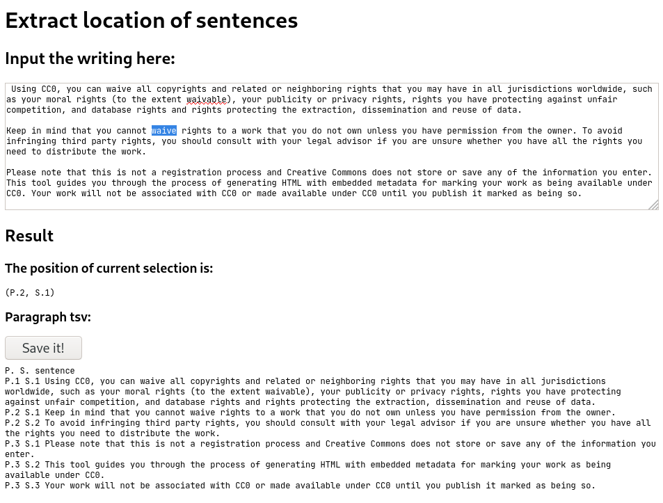

extract-sentence-location
===

英文中の文位置を自動抽出するツール。使用上の注意点は下記参照

[ここから使える (GitHub Pages)](https://nakanokurenai.github.io/extract-sentence-location)

これなに
---

- 英文中の文位置を抽出して TSV にしたり、選択範囲の位置を知るためのツール
- 問題点がいくつかあるため手動での修正が必要である
  + 引用のように文中に例外的に `.` が複数回出てくる場合の考慮がない

著作権 (LICENSE)
---
- CC0 とする
- 全文は [LICENSE](./LICENSE) を参照

Appendix. 動機
---
- 講義でノートにポイントとなる文章をまとめる必要があり、手動でやるのは馬鹿馬鹿しすぎて作った
    + 上記のように問題はあるが、十分助けになる
